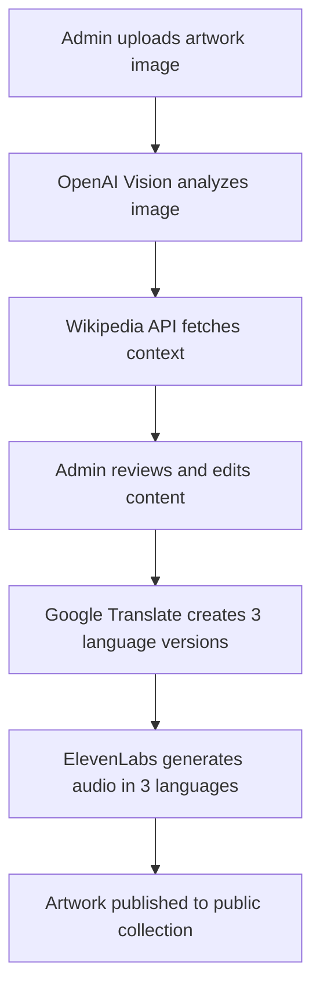
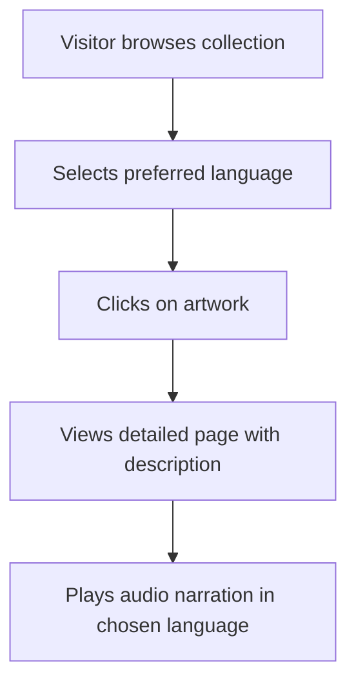

# 🏛️ Museum AI - Multi-Language Artwork Recognition System

## 📖 Project Overview

A comprehensive web application that revolutionizes the museum experience by allowing visitors to scan artwork with their phones and receive detailed information with AI-generated descriptions and audio narrations in multiple languages (English, French, Spanish).

## 🎯 Key Features

### 🤖 **AI-Powered Recognition**
- **OpenAI GPT-4o Vision**: Automatic artwork identification from uploaded images
- **Wikipedia Integration**: Enriches artwork data with historical context and sources
- **Smart Fallbacks**: Multiple recognition strategies for maximum accuracy

### 🌍 **Multi-Language Support**
- **Automatic Translation**: Google Translate API converts descriptions to 3 languages
- **Native Audio Narration**: ElevenLabs TTS with language-specific voices
- **Real-time Language Switching**: Visitors can change languages instantly

### 👨‍💼 **Admin Dashboard**
- **Drag & Drop Upload**: Simple image upload with instant AI analysis
- **Review & Edit**: Admin can correct/enhance AI-generated content
- **One-Click Finalization**: Automatically generates all translations and audio files

### 👥 **Visitor Interface**
- **Browse Collection**: View all artworks with language-specific content
- **Detailed View**: Rich artwork pages with audio guides
- **Mobile Optimized**: Perfect for museum visitors using phones

## 🛠️ Technology Stack

### **Backend (Node.js + TypeScript)**
```typescript
// Core Technologies
- Express.js: Web framework
- MongoDB + Mongoose: Database and ODM
- TypeScript: Type safety and better development experience
- Multer: File upload handling

// AI & External Services
- OpenAI API: Image recognition and text processing
- Google Translate API: Free translation service
- ElevenLabs API: High-quality text-to-speech
- Wikipedia API: Artwork information enrichment
```

### **Frontend (React + TypeScript)**
```typescript
// Core Technologies
- React 18: Modern UI framework
- TypeScript: Type safety
- React Router: Client-side routing
- Axios: HTTP client for API calls

// UI/UX
- CSS Grid & Flexbox: Responsive layouts
- CSS Animations: Smooth transitions
- Mobile-first design: Optimized for museum visitors
```

## 🚀 How It Works

### **Admin Workflow**


### **Visitor Workflow**


## 📁 Project Structure

```
ImageRecognition/
├── server/                 # Backend API
│   ├── src/
│   │   ├── index.ts       # Server entry point
│   │   ├── models/        # MongoDB schemas
│   │   │   └── Artwork.ts # Artwork data model
│   │   ├── routes/        # API endpoints
│   │   │   ├── admin.ts   # Admin operations
│   │   │   └── public.ts  # Public artwork access
│   │   ├── services/      # External integrations
│   │   │   ├── vision.ts      # OpenAI Vision API
│   │   │   ├── translation.ts # Google Translate
│   │   │   ├── resources.ts   # Wikipedia API
│   │   │   └── tts.ts         # ElevenLabs TTS
│   │   └── utils/         # Database utilities
│   │       └── db.ts      # MongoDB connection
│   ├── uploads/           # File storage
│   ├── package.json       # Dependencies
│   └── .env               # Environment variables
├── web/                   # Frontend React App
│   ├── src/
│   │   ├── App.tsx        # Main app component
│   │   ├── components/    # React components
│   │   │   ├── AdminDashboard.tsx    # Admin interface
│   │   │   ├── VisitorInterface.tsx  # Public interface
│   │   │   └── ArtworkDetail.tsx     # Detailed artwork view
│   │   └── App.css        # Comprehensive styling
│   └── package.json       # Frontend dependencies
└── README.md              # Project documentation
```

## 🔧 Setup Instructions

### **Prerequisites**
- Node.js 20+ (LTS recommended)
- MongoDB (local or MongoDB Atlas)
- API Keys (optional but recommended):
  - OpenAI API Key (for image recognition)
  - ElevenLabs API Key (for audio narration)

### **Backend Setup**
```bash
# Navigate to server directory
cd server

# Install dependencies
npm install

# Create environment file
cp .env.example .env
# Edit .env with your API keys and MongoDB URI

# Start development server
npm run dev
```

### **Frontend Setup**
```bash
# Navigate to web directory
cd web

# Install dependencies
npm install

# Start development server
npm run dev
```

### **Environment Variables**
```bash
# server/.env
PORT=4000
MONGODB_URI=mongodb://127.0.0.1:27017/museum_app
OPENAI_API_KEY=sk-your-openai-key-here
ELEVENLABS_API_KEY=your-elevenlabs-key-here
```

## 🧪 API Endpoints

### **Admin Endpoints**
```typescript
// Upload artwork image
POST /api/admin/upload
Content-Type: multipart/form-data
Body: { image: File }

// Finalize artwork with translations
POST /api/admin/:id/finalize
Content-Type: application/json
Body: {
  title: string,
  author: string,
  year: string,
  style: string,
  description: string,
  sourceLanguage: 'en' | 'fr' | 'es'
}

// Test translation service
POST /api/admin/test-translation
Body: { text: string, sourceLanguage: string }

// Test TTS service
POST /api/admin/test-tts
Body: { text: string, language: string }
```

### **Public Endpoints**
```typescript
// Get all artworks
GET /api/artworks

// Get specific artwork with language support
GET /api/artworks/:id?lang=en|fr|es

// Health check
GET /health
```

## 🎨 UI Components

### **Admin Dashboard Features**
- **Step-by-step workflow**: Upload → Review → Edit → Finalize
- **Real-time AI analysis**: Instant feedback from OpenAI and Wikipedia
- **Multi-language preview**: See all translations before publishing
- **Audio testing**: Play generated narrations in all languages
- **Success confirmation**: Clear feedback when artwork is published

### **Visitor Interface Features**
- **Language selector**: Easy switching between English, French, Spanish
- **Artwork gallery**: Beautiful grid layout with hover effects
- **Detailed artwork pages**: Rich content with audio players
- **Mobile responsive**: Optimized for museum visitors on phones
- **Share functionality**: Copy links, print artwork details

## 🎵 Audio System

### **ElevenLabs Integration**
```typescript
// Voice assignments for natural pronunciation
const VOICE_IDS = {
  en: '21m00Tcm4TlvDq8ikWAM', // Rachel (English female)
  fr: 'ThT5KcBeYPX3keUQqHPh', // Dorothy (French female)
  es: 'IKne3meq5aSn9XLyUdCD', // Domi (Spanish female)
}

// Automatic audio generation for all languages
const audioUrls = await generateMultiLanguageAudio({
  en: "This masterpiece was created during the Renaissance...",
  fr: "Ce chef-d'œuvre a été créé pendant la Renaissance...",
  es: "Esta obra maestra fue creada durante el Renacimiento..."
})
```

## 🌍 Translation System

### **Multi-Service Approach**
```typescript
// Primary: OpenAI (premium, accurate)
// Fallback: Google Translate (free, reliable)
// Final fallback: Mock translations (for testing)

const translations = await translateDescription(
  "This beautiful painting showcases Renaissance techniques.",
  'en' // source language
)

// Result:
{
  en: "This beautiful painting showcases Renaissance techniques.",
  fr: "Cette belle peinture présente les techniques de la Renaissance.",
  es: "Esta hermosa pintura muestra técnicas del Renacimiento."
}
```

## 📱 Mobile Optimization

### **Responsive Design**
- **Mobile-first approach**: Designed for museum visitors using phones
- **Touch-friendly interface**: Large buttons, easy navigation
- **Optimized images**: Fast loading for poor museum WiFi
- **Audio controls**: Native HTML5 audio with custom styling

## 🔒 Security & Performance

### **Security Features**
- **File upload validation**: Only images allowed
- **Environment variables**: API keys stored securely
- **CORS configuration**: Controlled cross-origin access
- **Input sanitization**: Protected against XSS attacks

### **Performance Optimizations**
- **Image optimization**: Automatic resizing and compression
- **Lazy loading**: Images load as needed
- **Caching strategies**: Static assets cached effectively
- **Database indexing**: Fast artwork queries

## 🚀 Deployment Options

### **Development**
```bash
# Backend
cd server && npm run dev

# Frontend
cd web && npm run dev
```

### **Production**
```bash
# Build backend
cd server && npm run build && npm start

# Build frontend
cd web && npm run build

# Serve with nginx or deploy to Vercel/Netlify
```

### **Docker Support**
```dockerfile
# Backend Dockerfile
FROM node:20-alpine
WORKDIR /app
COPY package*.json ./
RUN npm ci --only=production
COPY . .
RUN npm run build
EXPOSE 4000
CMD ["npm", "start"]
```

## 🎯 Use Cases

### **Museums**
- **Small museums**: Cost-effective multilingual guide system
- **Art galleries**: Enhanced visitor experience with AI insights
- **Educational institutions**: Interactive learning with audio guides

### **Developers**
- **AI integration example**: Real-world OpenAI Vision implementation
- **Multi-language apps**: Translation and TTS integration patterns
- **Full-stack TypeScript**: Modern development practices

## 🔮 Future Enhancements

### **Planned Features**
- **QR Code generation**: Physical QR codes for each artwork
- **Image similarity matching**: Recognize artwork from visitor photos
- **More languages**: Support for additional languages
- **Analytics dashboard**: Track popular artworks and languages
- **Offline support**: PWA functionality for poor connectivity

### **Technical Improvements**
- **Vector database**: Faster image similarity searches
- **CDN integration**: Global content delivery
- **Real-time updates**: WebSocket for live admin changes
- **Advanced caching**: Redis for improved performance

## 📊 Demo Data

### **Sample API Response**
```json
{
  "id": "artwork_123",
  "title": "Mona Lisa",
  "author": "Leonardo da Vinci",
  "year": "1503",
  "style": "Renaissance",
  "imageUrl": "/uploads/1234567890_mona_lisa.jpg",
  "descriptions": {
    "english": "This masterpiece portrait painting showcases Renaissance techniques...",
    "french": "Ce chef-d'œuvre de portrait présente les techniques de la Renaissance...",
    "spanish": "Esta obra maestra de retrato muestra técnicas del Renacimiento..."
  },
  "audioUrls": {
    "english": "/uploads/1234567890_narration_en.mp3",
    "french": "/uploads/1234567890_narration_fr.mp3",
    "spanish": "/uploads/1234567890_narration_es.mp3"
  },
  "sources": [
    {
      "provider": "wikipedia",
      "url": "https://en.wikipedia.org/wiki/Mona_Lisa"
    }
  ],
  "availableLanguages": {
    "en": true,
    "fr": true,
    "es": true
  }
}
```

## 💡 Key Innovation

### **What Makes This Special**
1. **Fully Automated Pipeline**: Upload → AI Analysis → Translation → Audio → Publication
2. **Real Multi-Language**: Not just UI translation, but content translation with native voices
3. **Museum-Ready**: Designed specifically for museum visitors and staff
4. **Developer-Friendly**: Clean code, comprehensive documentation, easy to extend

### **Business Value**
- **Cost Reduction**: Eliminates need for human translators and voice actors
- **Scalability**: Add new artworks and languages without manual work
- **Visitor Satisfaction**: Rich, accessible content in preferred language
- **Future-Proof**: AI-powered system that improves over time

---

## 🎉 Getting Started

1. **Clone the repository**
2. **Set up backend**: `cd server && npm install && npm run dev`
3. **Set up frontend**: `cd web && npm install && npm run dev`
4. **Visit**: http://localhost:3000 (visitor) or http://localhost:3000/admin (admin)
5. **Upload artwork** and see the magic happen! ✨

---

*Built with ❤️ for museums, developers, and art enthusiasts worldwide*
